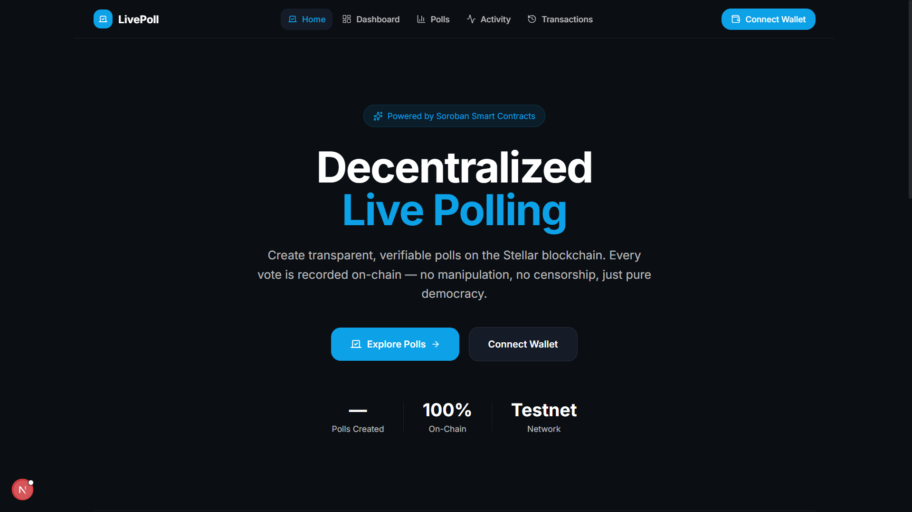
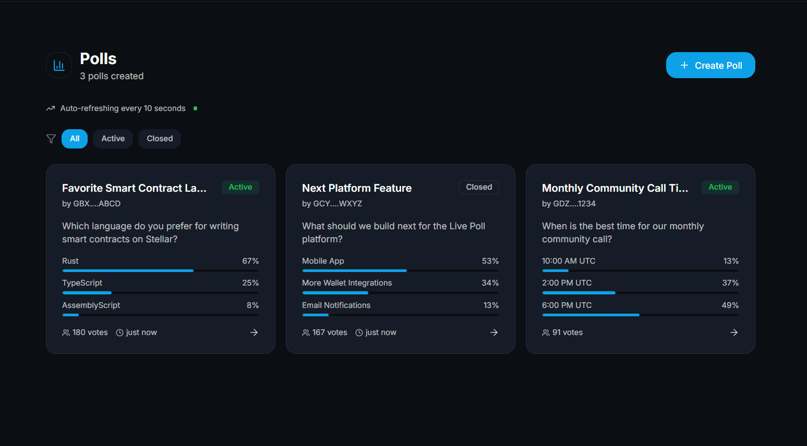
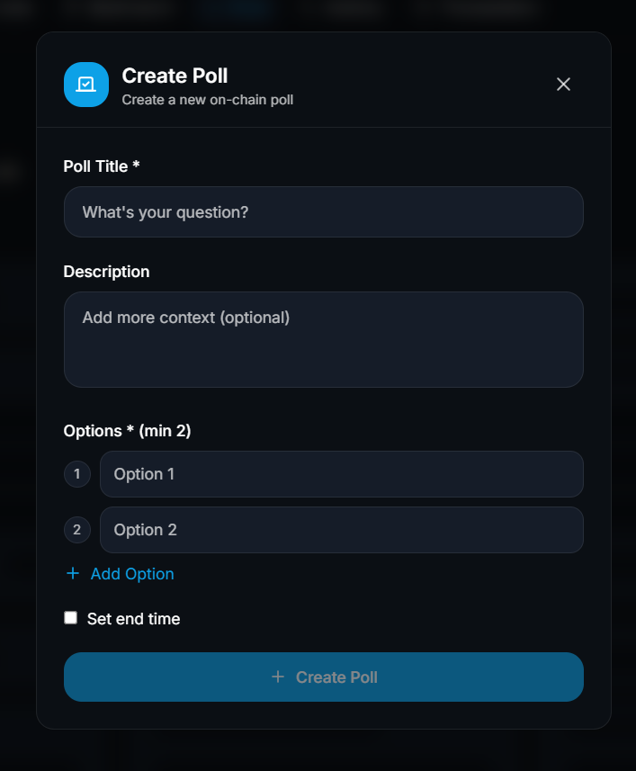
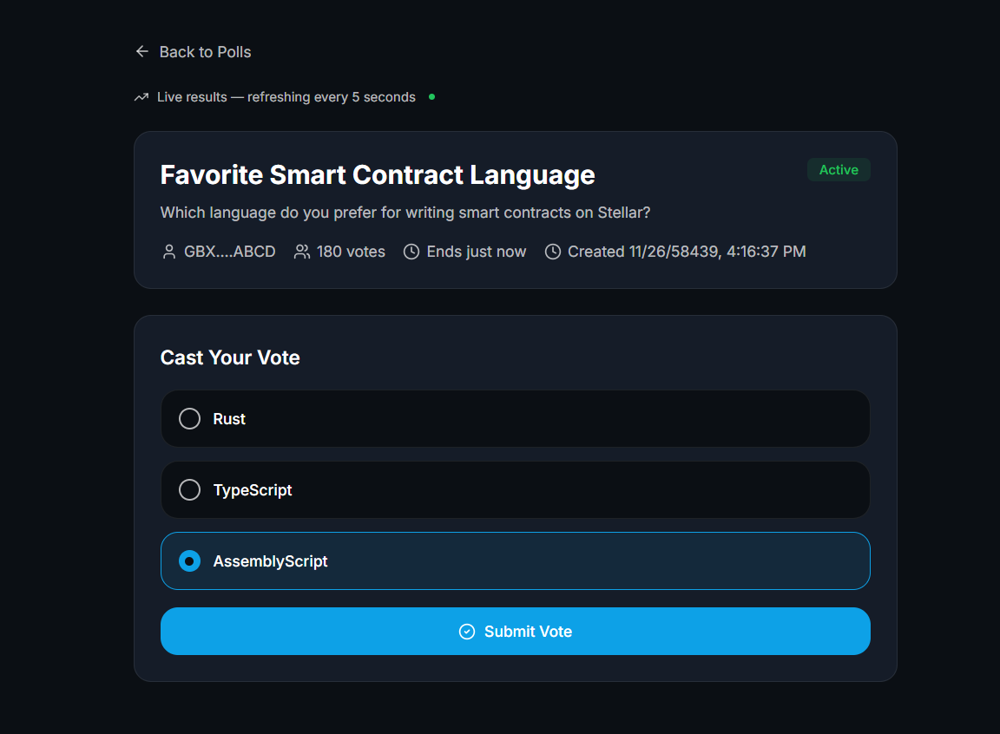
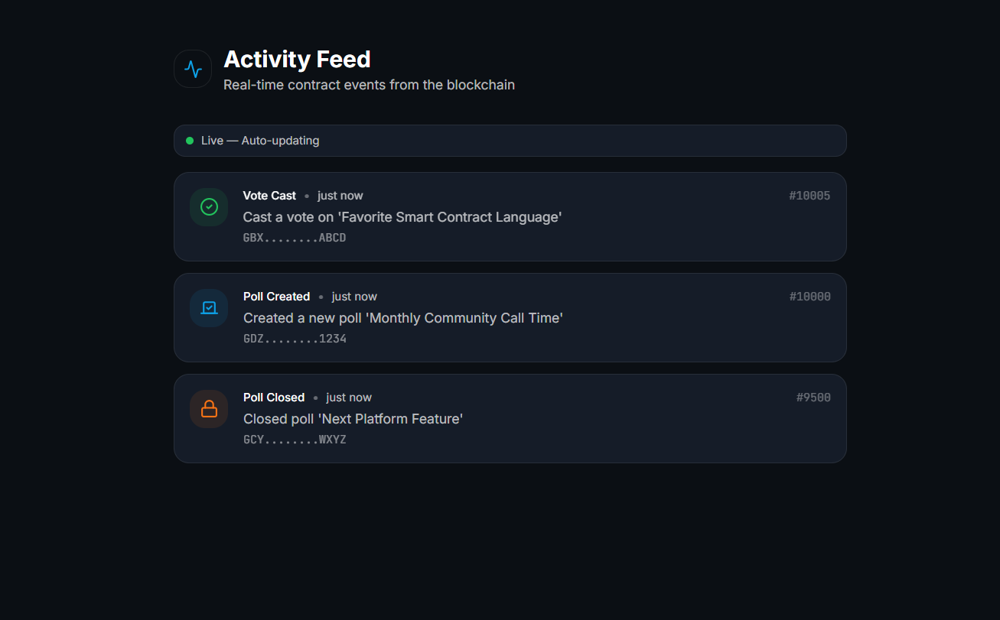
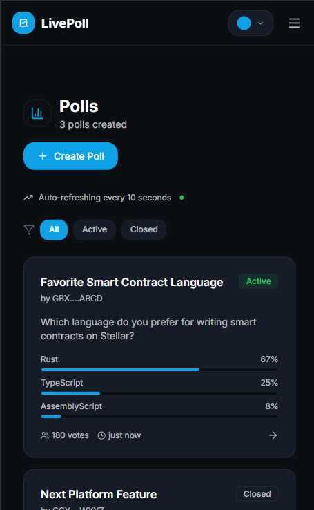
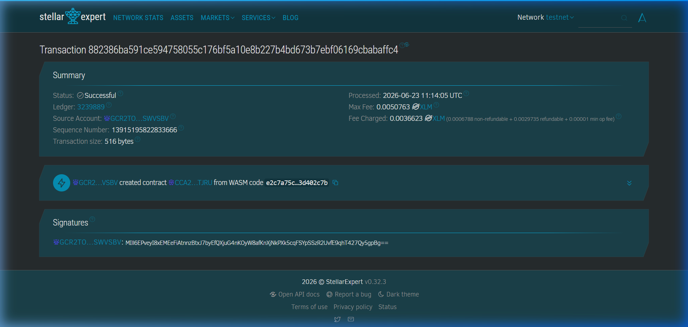
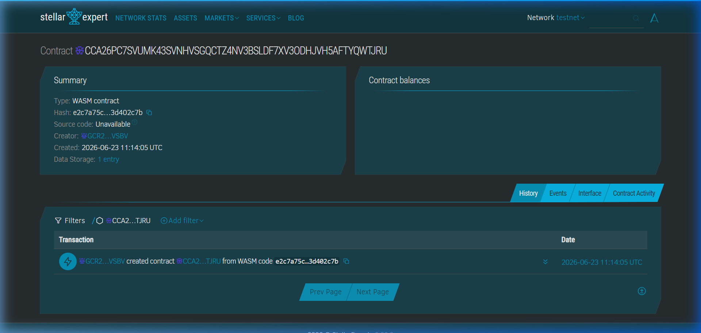
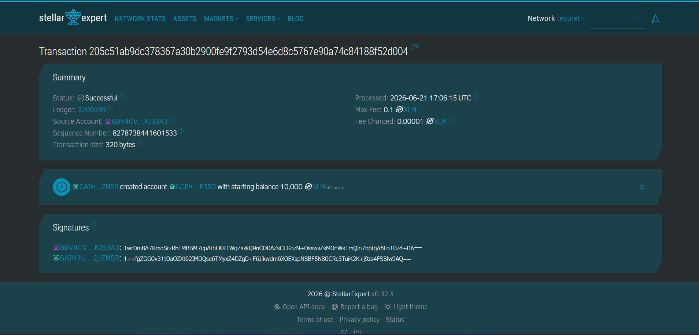

# 🗳️ LivePoll — Decentralized Polling on Stellar

LivePoll is a fully decentralized real-time polling platform built on
Soroban Smart Contracts, Next.js 15, and Stellar Wallets Kit.

Users can create polls, vote securely on-chain, and track results
in real time with complete transparency and immutability.

---

## 🔗 Project Links

- **Live Demo**: [https://live-poll-gamma.vercel.app/](https://live-poll-gamma.vercel.app/)
- **GitHub**: [https://github.com/arisudan-lab/Live_Poll](https://github.com/arisudan-lab/Live_Poll)
- **Contract on Stellar Expert**: [View Contract](https://stellar.expert/explorer/testnet/contract/CCA26PC7SVUMK43SVNHVSGQCTZ4NV3BSLDF7XV3ODHJVH5AFTYQWTJRU)
- **Contract on Stellar Lab**: [View on Lab](https://lab.stellar.org/r/testnet/contract/CCA26PC7SVUMK43SVNHVSGQCTZ4NV3BSLDF7XV3ODHJVH5AFTYQWTJRU)

---

## ⛓ Deployed Smart Contract Details

### Stellar Testnet

| Field | Value |
|-------|-------|
| **Contract ID** | `CCA26PC7SVUMK43SVNHVSGQCTZ4NV3BSLDF7XV3ODHJVH5AFTYQWTJRU` |
| **Deployer Address** | `GCR2TOD46JY2CEI6XUQIUABB36ZPKOISTUERPYSVFA37S64DB5SWVSBV` |
| **WASM Upload TX** | `78f87523b7d3cd9082ed6f22fd94abea420cbac81a2e6b63737c0255fa2a1f55` |
| **Deployment TX** | `882386ba591ce594758055c176bf5a10e8b227b4bd673b7ebf06169cbabaffc4` |
| **WASM Hash** | `e2c7a75c4e15f6b60382cad5d3a50a443e359cf4beb6641ee93593f23d402c7b` |
| **Network** | Stellar Testnet |
| **Network Passphrase** | `Test SDF Network ; September 2015` |

### Verify on Stellar Expert

- [View Deployment Transaction](https://stellar.expert/explorer/testnet/tx/882386ba591ce594758055c176bf5a10e8b227b4bd673b7ebf06169cbabaffc4)
- [View WASM Upload Transaction](https://stellar.expert/explorer/testnet/tx/78f87523b7d3cd9082ed6f22fd94abea420cbac81a2e6b63737c0255fa2a1f55)
- [View Contract](https://stellar.expert/explorer/testnet/contract/CCA26PC7SVUMK43SVNHVSGQCTZ4NV3BSLDF7XV3ODHJVH5AFTYQWTJRU)
- [View Deployer Account](https://stellar.expert/explorer/testnet/account/GCR2TOD46JY2CEI6XUQIUABB36ZPKOISTUERPYSVFA37S64DB5SWVSBV)

---

## 📸 Screenshots & Architecture Proof

### 1. Landing Page


### 2. Poll Dashboard


### 3. Poll Creation


### 4. Voting Interface


### 5. Activity Feed


### 6. Mobile Responsive Design


### 7. Smart Contract Deployment on Stellar Expert


### 8. Smart Contract on Stellar Expert


### 9. Stellar Expert Verification


---

## 🏗 Architecture

```text
                 CREATE POLL
                      │
                      ▼
          ┌────────────────────┐
          │ Soroban Contract   │
          │ (Stellar Testnet)  │
          └────────────────────┘
                 ▲       ▲
                 │       │
          Vote Cast   Close Poll
                 │
                 ▼
        Event Emission Layer
                 │
                 ▼
      Next.js Activity Feed
```

---

## 🔐 Wallet Authentication Flow

```text
[Freighter / xBull / Albedo Wallet]
        │
        ▼
Connect via StellarWalletsKit
        │
        ▼
Public Key Retrieved
        │
        ▼
Wallet Session Stored (Zustand)
        │
        ▼
Access Poll Features
```

---

## 📜 Smart Contract Specifications

The Soroban smart contract is written in **Rust** and provides the following core methods:

| Method | Description |
|--------|-------------|
| `create_poll()` | Create a new on-chain poll with title, description, options, and end time |
| `vote()` | Cast a vote on a specific poll option (one vote per wallet) |
| `close_poll()` | Close an active poll (only the creator can close) |
| `get_poll()` | Retrieve a specific poll by ID |
| `get_polls()` | Get a paginated list of polls (newest first, max 50) |
| `get_poll_count()` | Get the total number of polls created |
| `get_voter()` | Check if a specific address has voted on a poll |

### Contract Events Emitted

| Event | When |
|-------|------|
| `poll_created` | A new poll is created |
| `vote_cast` | A vote is submitted |
| `poll_closed` | A poll is closed by its creator |

### Data Model

```rust
struct Poll {
    id: u32,
    creator: Address,
    title: String,
    description: String,
    options: Vec<PollOption>,
    total_votes: u32,
    status: PollStatus,  // Active | Closed
    created_at: u64,
    end_time: u64,
}
```

---

## 🚀 User Proof of Concept

1. **Connect Wallet** — Link Freighter, xBull, or Albedo wallet
2. **Create Poll** — Define a question with 2–10 answer options
3. **Cast Vote** — Select an option and submit on-chain
4. **View Live Results** — Watch animated progress bars update in real time
5. **Track Events** — Monitor on-chain activity in the Activity Feed
6. **Close Poll** — The creator can end the poll at any time

---

## 🛠 Tech Stack

| Layer | Technology |
|-------|-----------|
| Frontend | Next.js 15, React 19, TypeScript |
| Styling | Tailwind CSS v4, shadcn/ui |
| State Management | Zustand, React Query (TanStack) |
| Smart Contract | Soroban (Rust), Stellar SDK |
| Wallet | Stellar Wallets Kit (Freighter, xBull, Albedo) |
| Deployment | Vercel (frontend), Stellar Testnet (contract) |

---

## ⚙️ Local Setup

### Prerequisites

Make sure the following are installed:

* Node.js 20+
* npm 10+
* Git
* Freighter Wallet (for Stellar Testnet interaction)

Verify installation:

```bash
node -v
npm -v
git --version
```

---

### 1. Clone the Repository

```bash
git clone https://github.com/arisudan-lab/Live_Poll.git
cd Live_Poll
```

---

### 2. Install Dependencies

```bash
npm install
```

---

### 3. Configure Environment Variables

Create a `.env.local` file in the project root:

```env
NEXT_PUBLIC_STELLAR_NETWORK=testnet
NEXT_PUBLIC_STELLAR_RPC_URL=https://soroban-testnet.stellar.org:443
NEXT_PUBLIC_STELLAR_NETWORK_PASSPHRASE="Test SDF Network ; September 2015"
NEXT_PUBLIC_CONTRACT_ID=CCA26PC7SVUMK43SVNHVSGQCTZ4NV3BSLDF7XV3ODHJVH5AFTYQWTJRU
```

> The contract ID above is the deployed LivePoll smart contract on Stellar Testnet.

---

### 4. Start Development Server

```bash
npm run dev
```

The application will be available at:

```text
http://localhost:3000
```

---

### 5. Connect Stellar Wallet

1. Install [Freighter Wallet](https://www.freighter.app/) browser extension.
2. Switch network to **Stellar Testnet**.
3. Fund your testnet account using [Stellar Friendbot](https://friendbot.stellar.org/).
4. Connect the wallet from the LivePoll dashboard.

---

### 6. Build for Production

```bash
npm run build
npm start
```

---

### Project Structure

```text
Live_Poll/
│
├── app/                    # Next.js 15 app router pages
│   ├── page.tsx            # Landing page
│   ├── layout.tsx          # Root layout with providers
│   ├── polls/              # Poll listing and detail pages
│   ├── dashboard/          # User dashboard
│   ├── activity/           # On-chain activity feed
│   └── transactions/       # Transaction history
│
├── components/             # Reusable React components
│   ├── layout/             # Header, footer, navigation
│   ├── polls/              # Poll cards, creation modal
│   ├── wallet/             # Wallet connection UI
│   ├── activity/           # Activity feed components
│   └── ui/                 # Base UI primitives (shadcn)
│
├── contracts/              # Soroban smart contract (Rust)
│   └── live_poll/
│       ├── Cargo.toml
│       └── src/lib.rs      # Contract source code
│
├── hooks/                  # Custom React hooks
├── lib/
│   ├── stellar/            # Stellar SDK integration
│   │   ├── config.ts       # Network & contract configuration
│   │   ├── contract.ts     # Smart contract interaction layer
│   │   ├── events.ts       # On-chain event parsing
│   │   ├── server.ts       # Soroban RPC server setup
│   │   └── transaction.ts  # Transaction building & submission
│   └── utils.ts            # Utility functions
│
├── stores/                 # Zustand state stores
├── types/                  # TypeScript type definitions
├── public/
│   └── screenshots/        # App screenshots for README
│
├── .env.example            # Environment variable template
├── .env.local              # Local environment config (not committed)
├── package.json
└── README.md
```

---

## 🔧 Smart Contract Deployment Guide

### Prerequisites

1. Install [Rust](https://rustup.rs/) (with `cargo`).
2. Add the WebAssembly target:
   ```bash
   rustup target add wasm32-unknown-unknown
   ```
3. Install the [Stellar CLI](https://soroban.stellar.org/docs/tools/developer-tools):
   ```bash
   cargo install --locked stellar-cli --features opt
   ```

### Build the Contract

```bash
cd contracts/live_poll
cargo build --target wasm32-unknown-unknown --release
```

Output: `contracts/live_poll/target/wasm32-unknown-unknown/release/live_poll.wasm`

### Deploy to Testnet

```bash
# Generate a key identity
stellar keys generate deployer --network testnet

# Deploy the contract
stellar contract deploy \
  --wasm target/wasm32-unknown-unknown/release/live_poll.wasm \
  --source deployer \
  --network testnet
```

The CLI will output the Contract ID. Update your `.env.local` with this value.

---

### Troubleshooting

#### Dependency Issues

```bash
rm -rf node_modules package-lock.json
npm install
```

#### Port Already in Use

```bash
lsof -i :3000
kill -9 <PID>
```

#### Environment Variables Not Loading

Restart the development server after modifying `.env.local`:

```bash
npm run dev
```

---

### Testnet Resources

* Freighter Wallet: https://www.freighter.app/
* Stellar Friendbot: https://friendbot.stellar.org/
* Stellar Testnet Explorer: https://stellar.expert/explorer/testnet
* Soroban Documentation: https://soroban.stellar.org/docs

---

## 📜 License

MIT
