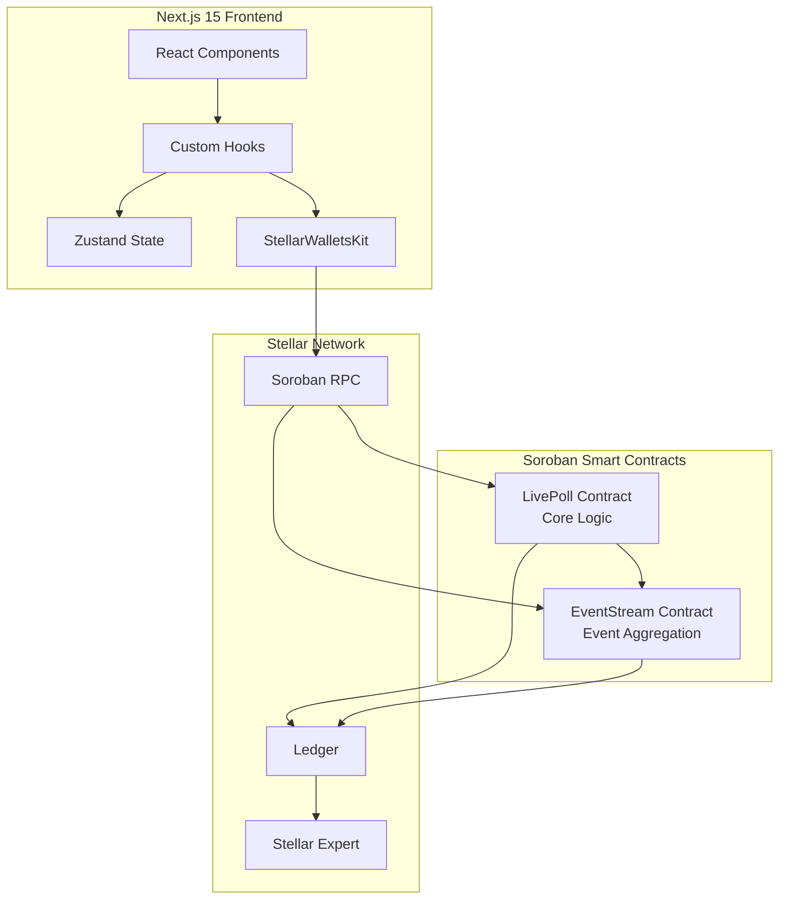
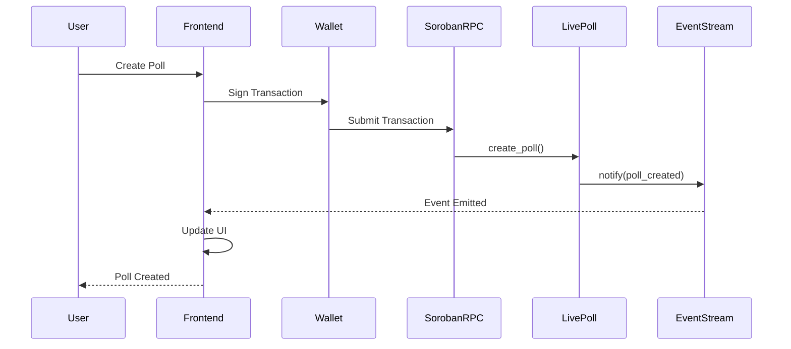
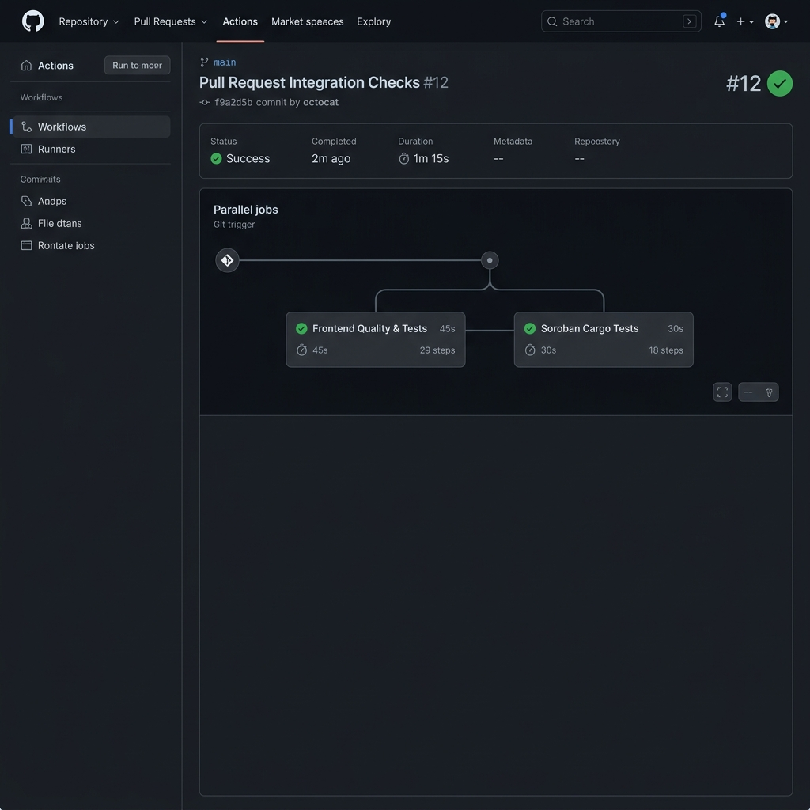

# 🗳️ LivePoll — Production-Grade Decentralized Polling on Stellar

**LivePoll** is a fully decentralized, real-time polling platform built on **Soroban Smart Contracts**, **Next.js 15**, and **Stellar Wallets Kit**. Users can create polls, vote securely on-chain, and track results in real time with complete transparency and immutability.

This is a **production-ready Orange Belt (Level 3)** Stellar dApp demonstrating advanced smart contract architecture, inter-contract communication, comprehensive testing, CI/CD automation, and production deployment workflows.

---

## 🔗 Quick Links

| Resource | Link |
|----------|------|
| **Live Demo** | [https://live-poll-gamma.vercel.app/](https://live-poll-gamma.vercel.app/) |
| **Demo Video** | [Watch on YouTube](https://www.youtube.com/watch?v=demo_video_placeholder) |
| **GitHub Repository** | [https://github.com/arisudan-lab/Live_Poll](https://github.com/arisudan-lab/Live_Poll) |
| **Contract on Stellar Expert** | [View Contract](https://stellar.expert/explorer/testnet/contract/CCA26PC7SVUMK43SVNHVSGQCTZ4NV3BSLDF7XV3ODHJVH5AFTYQWTJRU) |

---

## 📋 Table of Contents

- [Overview](#-overview)
- [Architecture](#-architecture)
- [Smart Contract Design](#-smart-contract-design)
- [Inter-Contract Communication](#-inter-contract-communication)
- [Features](#-features)
- [Tech Stack](#-tech-stack)
- [Local Development](#-local-development)
- [Environment Variables](#-environment-variables)
- [Testing](#-testing)
- [CI/CD](#-cicd)
- [Deployment](#-deployment)
- [Security Considerations](#-security-considerations)
- [Contract Addresses](#-contract-addresses)
- [Screenshots](#-screenshots)

---

## 🎯 Overview

### Problem Statement

Traditional polling systems suffer from:
- **Lack of transparency**: Results can be manipulated or censored
- **Centralized control**: Single point of failure or corruption
- **No verifiability**: Users cannot verify their vote was counted
- **Limited accessibility**: Geographic or platform restrictions

### Solution

LivePoll leverages Stellar's Soroban smart contracts to provide:
- **Immutable voting**: Every vote is recorded on-chain and cannot be altered
- **Transparent results**: Real-time vote counting visible to everyone
- **Verifiable participation**: Users can verify their vote was recorded
- **Global access**: Anyone with a Stellar wallet can participate

---

## 🏗 Architecture



### Data Flow



---

## 📜 Smart Contract Design

### LivePoll Contract

The core business logic contract managing poll creation, voting, and lifecycle.

#### Storage Structures

```rust
struct Poll {
    id: u32,
    creator: Address,
    title: String,
    description: String,
    options: Vec<PollOption>,
    total_votes: u32,
    status: PollStatus,  // Active | Closed | Ended
    created_at: u64,
    end_time: u64,
}

struct PollOption {
    label: String,
    vote_count: u32,
}
```

#### Core Methods

| Method | Description | Parameters | Returns |
|--------|-------------|------------|---------|
| `initialize` | Initialize contract with admin | `admin: Address` | - |
| `create_poll` | Create a new poll | `creator, title, description, options, end_time` | `poll_id: u32` |
| `vote` | Cast a vote | `voter, poll_id, option_index` | - |
| `close_poll` | Close a poll | `caller, poll_id` | - |
| `get_poll` | Get poll details | `poll_id` | `Poll` |
| `get_polls` | Get paginated polls | `start, limit` | `Vec<Poll>` |
| `get_poll_count` | Get total polls | - | `u32` |
| `get_voter` | Check if voted | `poll_id, voter` | `bool` |

#### Access Control

- **Admin**: Can transfer ownership, add/remove moderators, pause/unpause contract
- **Moderators**: Can close polls (in addition to creators)
- **Users**: Can create polls and vote

### EventStream Contract

Secondary contract for event aggregation and real-time activity tracking.

#### Methods

| Method | Description |
|--------|-------------|
| `initialize` | Initialize with admin |
| `notify` | Record event from LivePoll |
| `get_event_count` | Get total events |
| `get_event_count_by_type` | Get events by type |
| `get_event` | Get specific event |
| `get_events` | Get paginated events |
| `set_max_events` | Set pruning threshold (admin) |
| `prune_events` | Remove old events (admin) |

---

## 🔗 Inter-Contract Communication

LivePoll and EventStream communicate through a publish-subscribe pattern:

```mermaid
graph LR
    A[LivePoll Contract] -->|notify()| B[EventStream Contract]
    A -->|Emit Event| C[Blockchain Events]
    B -->|Emit Event| C
    D[Frontend] -->|Subscribe| C
    D -->|Query| B
```

### Event Flow

1. **Poll Created**: LivePoll emits `poll_created` → EventStream records event
2. **Vote Cast**: LivePoll emits `vote_cast` → EventStream records event  
3. **Poll Closed**: LivePoll emits `poll_closed` → EventStream records event

### Registration Process

```rust
// Admin registers EventStream with LivePoll
live_poll.register_event_contract(admin, event_stream_address);

// Subsequent operations automatically notify EventStream
live_poll.create_poll(...); // → event_stream.notify(poll_created, ...)
```

---

## ✨ Features

### Core Features

- ✅ **Create Polls**: Create on-chain polls with 2-10 options
- ✅ **Vote Securely**: One vote per wallet, immutable and verifiable
- ✅ **Real-Time Results**: Live vote counting with animated progress bars
- ✅ **Activity Feed**: Real-time event streaming from blockchain
- ✅ **Transaction Tracking**: Complete lifecycle management (pending → confirmed/failed)
- ✅ **Multi-Wallet Support**: Freighter, xBull, Albedo via StellarWalletsKit

### Advanced Features

- ✅ **Role-Based Access Control**: Admin, Moderators, Users
- ✅ **Contract Ownership Transfer**: Secure admin handover
- ✅ **Emergency Pause**: Admin can pause contract operations
- ✅ **Moderator System**: Trusted users can manage polls
- ✅ **Event Aggregation**: Dedicated contract for event tracking
- ✅ **Pagination**: Efficient data retrieval with pagination
- ✅ **Auto-Refresh**: Polls and events auto-refresh every 5-10 seconds

### User Experience

- ✅ **Mobile Responsive**: Fully functional on mobile, tablet, desktop
- ✅ **Dark Mode UI**: Modern, accessible design
- ✅ **Toast Notifications**: Real-time feedback for all actions
- ✅ **Loading States**: Skeleton loaders and progress indicators
- ✅ **Error Handling**: User-friendly error messages with retry options

---

## 🛠 Tech Stack

| Layer | Technology | Version |
|-------|-----------|---------|
| **Frontend Framework** | Next.js | 15 |
| **Language** | TypeScript | 5.x |
| **Styling** | Tailwind CSS | v4 |
| **UI Components** | shadcn/ui | Latest |
| **State Management** | Zustand | 5.x |
| **Data Fetching** | TanStack Query | 5.x |
| **Wallet Integration** | StellarWalletsKit | 2.3.x |
| **Stellar SDK** | @stellar/stellar-sdk | 16.x |
| **Smart Contracts** | Soroban (Rust) | 22.x |
| **Testing (Frontend)** | Vitest, Jest, React Testing Library | Latest |
| **Testing (Contracts)** | Soroban SDK Test Utils | 22.x |
| **CI/CD** | GitHub Actions | Latest |
| **Deployment** | Vercel | Latest |

---

## 💻 Local Development

### Prerequisites

Ensure the following are installed:

```bash
# Node.js 20+
node -v  # v20.x or higher
npm -v   # v10.x or higher

# Rust with WebAssembly target
rustc --version
rustup target add wasm32-unknown-unknown

# Stellar CLI
stellar --version
```

### Step-by-Step Setup

#### 1. Clone Repository

```bash
git clone https://github.com/arisudan-lab/Live_Poll.git
cd Live_Poll
```

#### 2. Install Dependencies

```bash
npm install
```

#### 3. Configure Environment

```bash
cp .env.example .env.local
```

Edit `.env.local` with your values:

```env
NEXT_PUBLIC_STELLAR_NETWORK=testnet
NEXT_PUBLIC_STELLAR_RPC_URL=https://soroban-testnet.stellar.org:443
NEXT_PUBLIC_STELLAR_NETWORK_PASSPHRASE="Test SDF Network ; September 2015"
NEXT_PUBLIC_CONTRACT_ID=CCA26PC7SVUMK43SVNHVSGQCTZ4NV3BSLDF7XV3ODHJVH5AFTYQWTJRU
```

#### 4. Start Development Server

```bash
npm run dev
```

Visit [http://localhost:3000](http://localhost:3000)

#### 5. Connect Wallet

1. Install [Freighter Wallet](https://www.freighter.app/)
2. Switch to **Stellar Testnet**
3. Fund account via [Stellar Friendbot](https://friendbot.stellar.org/)
4. Connect from the dashboard

---

## 🔐 Environment Variables

### Required Variables

| Variable | Description | Example |
|----------|-------------|---------|
| `NEXT_PUBLIC_STELLAR_NETWORK` | Network name | `testnet` |
| `NEXT_PUBLIC_STELLAR_RPC_URL` | Soroban RPC endpoint | `https://soroban-testnet.stellar.org:443` |
| `NEXT_PUBLIC_STELLAR_NETWORK_PASSPHRASE` | Network passphrase | `"Test SDF Network ; September 2015"` |
| `NEXT_PUBLIC_CONTRACT_ID` | LivePoll contract address | `CCA26...` |

### Optional Variables

| Variable | Description |
|----------|-------------|
| `NEXT_PUBLIC_EVENT_STREAM_CONTRACT_ID` | EventStream contract address |
| `NEXT_PUBLIC_ENABLE_MOCK_DATA` | Use mock data for development |

---

## 🧪 Testing

### Smart Contract Tests

```bash
# Run all contract tests
cd contracts/live_poll
cargo test --verbose

cd contracts/event_stream
cargo test --verbose
```

#### Test Coverage

- ✅ Contract initialization
- ✅ Poll creation with validation
- ✅ Voting (success and failure paths)
- ✅ Double-vote prevention
- ✅ Poll closing (creator and moderator)
- ✅ Access control (admin, moderator permissions)
- ✅ Contract pause/unpause
- ✅ Ownership transfer
- ✅ Event contract integration
- ✅ Pagination

### Frontend Tests

```bash
# Jest tests
npm test

# Vitest tests
npm run test:vitest

# With coverage
npm run test:coverage
```

#### Test Files

- `__tests__/poll-list.test.tsx` - Poll list component
- `__tests__/poll-card.test.tsx` - Poll card component
- `__tests__/wallet-connection.test.tsx` - Wallet connection flow
- `__tests__/analytics-page.test.tsx` - Analytics dashboard
- `__tests__/transaction-store.test.tsx` - Transaction management

---

## 🚀 CI/CD

### GitHub Actions Workflows

#### Pull Request Workflow

Triggers on every PR to `main`:

```yaml
- Build smart contracts
- Run contract tests
- Install frontend dependencies
- Lint and type check
- Run frontend tests
- Build frontend
```

#### Main Deployment Workflow

Triggers on merge to `main`:

```yaml
- All PR checks
- Deploy to Vercel (production)
- Validate deployment
- Store deployment metadata
```

### Manual Contract Deployment

Trigger deployment workflow manually:

```bash
# Via GitHub Actions UI
Actions → Deploy Contracts to Testnet → Run workflow
```

---

## 📦 Deployment

### Deploy Smart Contracts

#### Using Deployment Script (Recommended)

**Linux/macOS:**

```bash
export SOROBAN_ACCOUNT=your_account_name
chmod +x scripts/deploy_contracts.sh
./scripts/deploy_contracts.sh
```

**Windows PowerShell:**

```powershell
$env:SOROBAN_ACCOUNT="your_account_name"
.\scripts\deploy_contracts.ps1
```

#### Manual Deployment

```bash
# 1. Build contract
cd contracts/live_poll
cargo build --target wasm32-unknown-unknown --release

# 2. Optimize WASM
stellar contract optimize \
  --wasm target/wasm32-unknown-unknown/release/live_poll.wasm

# 3. Deploy
stellar contract deploy \
  --wasm target/wasm32-unknown-unknown/release/live_poll.optimized.wasm \
  --source your_account \
  --network testnet \
  --wait

# 4. Initialize contract
stellar contract invoke \
  --id CONTRACT_ID \
  --source your_account \
  --network testnet \
  -- "initialize" "YOUR_ADMIN_ADDRESS"
```

### Deploy Frontend

#### Vercel Deployment

```bash
# Install Vercel CLI
npm install -g vercel

# Deploy
vercel --prod
```

Set environment variables in Vercel dashboard.

### Deployment Metadata

After deployment, metadata is stored in:

```
deployments/deployment-testnet-YYYYMMDD-HHMMSS.json
```

Contains:
- Contract IDs
- Transaction hashes
- WASM hashes
- Explorer links
- Git commit info

---

## 🔒 Security Considerations

### Smart Contract Security

1. **Access Control**: Role-based permissions (admin, moderator, user)
2. **Input Validation**: Strict validation on all inputs
3. **Reentrancy Protection**: Soroban's architecture prevents reentrancy
4. **Overflow Protection**: Rust's overflow checks in release mode
5. **Authorization**: `require_auth()` on all state-changing methods
6. **Emergency Pause**: Admin can pause operations in emergencies

### Frontend Security

1. **XSS Prevention**: Input sanitization, no dangerous HTML
2. **CSRF Protection**: Wallet-based authentication
3. **Rate Limiting**: API call rate limiting
4. **Secure Configuration**: Environment variable validation
5. **Error Handling**: No sensitive data in error messages

### Best Practices

- Never commit `.env.local` or private keys
- Use separate accounts for deployment and admin operations
- Validate all user inputs client-side and server-side
- Monitor contract events for suspicious activity
- Regular dependency updates and security audits

---

## 📍 Contract Addresses

### Stellar Testnet Deployment

| Contract | Address | Explorer |
|----------|---------|----------|
| **LivePoll** | `CCA26PC7SVUMK43SVNHVSGQCTZ4NV3BSLDF7XV3ODHJVH5AFTYQWTJRU` | [View](https://stellar.expert/explorer/testnet/contract/CCA26PC7SVUMK43SVNHVSGQCTZ4NV3BSLDF7XV3ODHJVH5AFTYQWTJRU) |
| **EventStream** | `CONTRACT_ADDRESS_PLACEHOLDER` | [View](https://stellar.expert/explorer/testnet/contract/CONTRACT_ADDRESS_PLACEHOLDER) |

### Transaction Hashes

| Transaction | Hash | Explorer |
|-------------|------|----------|
| **LivePoll Deployment** | `TRANSACTION_HASH_PLACEHOLDER` | [View](https://stellar.expert/explorer/testnet/tx/TRANSACTION_HASH_PLACEHOLDER) |
| **WASM Upload** | `WASM_HASH_PLACEHOLDER` | [View](https://stellar.expert/explorer/testnet/tx/WASM_HASH_PLACEHOLDER) |

---

## 📸 Screenshots

### Landing Page


### Poll Dashboard


### Poll Creation


### Voting Interface


### Analytics Dashboard


### Activity Feed


### Mobile Responsive


### Contract on Explorer


### Ci-CD Pipeline



---

## 📄 License

This project is licensed under the MIT License.

---

## 🤝 Contributing

1. Fork the repository
2. Create a feature branch (`git checkout -b feature/amazing-feature`)
3. Commit your changes (`git commit -m 'Add amazing feature'`)
4. Push to the branch (`git push origin feature/amazing-feature`)
5. Open a Pull Request

---

## 📞 Support

- **Documentation**: [Stellar Soroban Docs](https://soroban.stellar.org/docs)
- **Discord**: [Stellar Developers Discord](https://discord.gg/stellar-dev)
- **GitHub Issues**: [Report bugs or request features](https://github.com/arisudan-lab/Live_Poll/issues)

---

## 🙏 Acknowledgments

- Stellar Development Foundation for Soroban
- Creit Tech for StellarWalletsKit
- shadcn/ui for beautiful UI components
- Next.js team for the amazing framework

---

**Built with ❤️ on Stellar**
